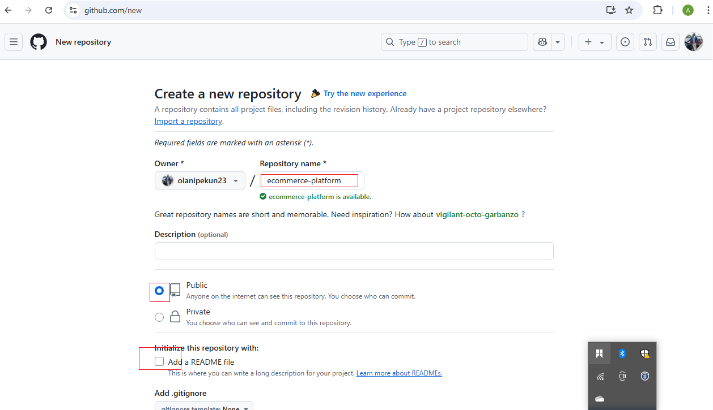
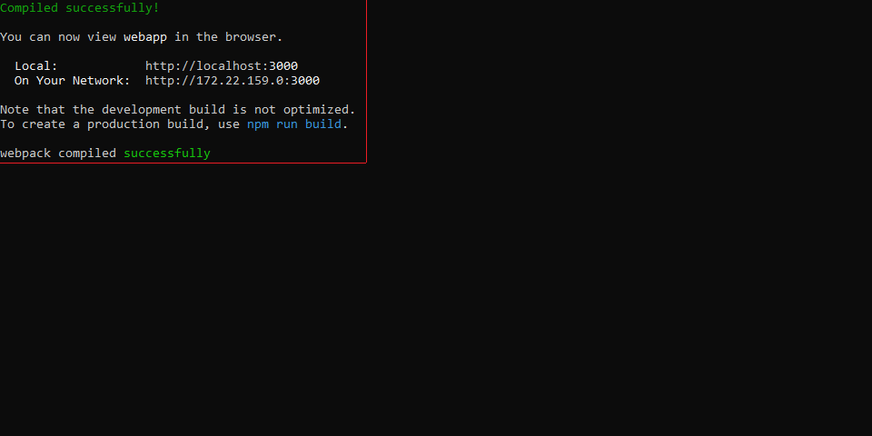
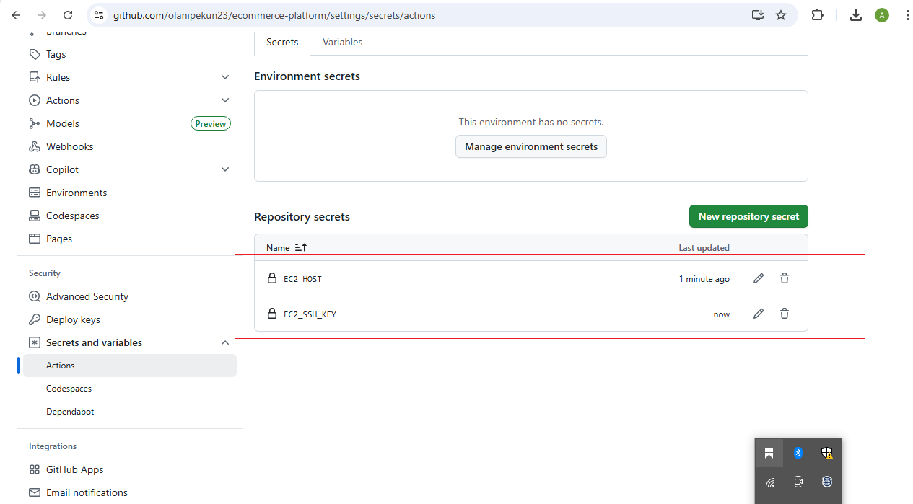

# E-Commerce with GitHub Actions

## 📅 Capstone Project: E-Commerce Application CI/CD Pipeline

---

## 📆 Project Overview

This project implements a **fully automated CI/CD pipeline** for a full-stack **E-Commerce Platform** using **GitHub Actions**. The application consists of two main components:

* **E-Commerce API**: A Node.js/Express backend responsible for product listings, user accounts, and order processing.
* **E-Commerce Frontend**: A React web application allowing users to browse products, manage accounts, and place orders.

The main goal is to ensure **continuous integration** and **continuous delivery** using GitHub Actions, Docker, and cloud deployment.

---

## 🚀 Project Tasks

### Task 1: Project Setup

* Create a GitHub repository named `ecommerce-platform`.




* Inside the repository, create two directories:

  * `api/` for the backend.
  * `webapp/` for the frontend.


### Task 2: Initialize GitHub Actions

* Initialize a Git repository with the above structure.


* Create a `.github/workflows/` directory for storing GitHub Actions workflows.


### Task 3: Backend API Setup

* Set up a Node.js/Express application inside the `api/` directory.
* Add basic features:

  * Product listing
  * User account management
  * Order processing
* Add unit tests using Jest or Mocha.


### Task 4: Frontend Web Application Setup

* Set up a React app inside the `webapp/` directory.
* Connect to the backend API.
* Implement key UI features:

  * Product display
  * User login
  * Order placement


  




### Task 5: Continuous Integration Workflow

* Create GitHub Actions workflows for backend and frontend.
* Each workflow should:

  * Install dependencies
  * Run tests
  * Build the application


  


### Task 6: Docker Integration

* Create Dockerfiles in both `api/` and `webapp/` directories.


* Modify the workflows to build Docker images for both components.


### Task 7: Deploy to Cloud

* Choose AWS as the cloud provider.
* Set up an EC2 instance to host the backend.
* Use GitHub Actions to:

  * Upload Docker images to EC2 using `scp`

  

  

  

  


  * Deploy images using `docker run`

  

  


  * Store sensitive credentials using

**GitHub Secrets**:

  * `EC2_HOST`, `EC2_SSH_KEY`, etc.

  




### Task 8: Continuous Deployment

* Set up workflows to **automatically deploy** whenever code is pushed to the `main` branch.
* Backend workflow example:

  ```yaml
  on:
    push:
      branches:
        - main
  ```


### Task 9: Performance and Security

* Implement **Docker layer caching** to speed up build times.
* Use **GitHub Secrets** to store:

  * Cloud credentials
  * API keys
  * JWT secrets
  * Database connection strings


### Task 10: Documentation

* Document the project setup, structure, workflow, and instructions for local development in this `README.md` file.

---

## 🔧 Local Development Instructions

### Backend (API)

```bash
git clone https://github.com/your-username/ecommerce-platform.git
cd ecommerce-platform/api
npm install
npm run dev
```

### Frontend (WebApp)

```bash
cd ../webapp
npm install
npm start
```

### Docker Build and Run Locally

```bash
docker build -t ecommerce-api ./api
docker run -d -p 5000:5000 --name ecommerce-api ecommerce-api
```

---

## 🌐 Deployment Instructions

### Using GitHub Actions

* Workflow is automatically triggered on push to `main`.
* CI/CD steps include:

  * Build Docker image
  * Save image
  * Upload image to EC2
  * SSH into EC2 and deploy container

### Manual Deployment (if needed)

```bash
scp -i your-key.pem ecommerce-api.tar ubuntu@<EC2_HOST>:/home/ubuntu/
ssh -i your-key.pem ubuntu@<EC2_HOST>
docker load < ecommerce-api.tar
docker stop ecommerce-api || true
docker rm ecommerce-api || true
docker run -d -p 80:5000 --name ecommerce-api ecommerce-api
```

---

## 🎓 Technologies Used

* **Backend**: Node.js, Express
* **Frontend**: React.js
* **CI/CD**: GitHub Actions
* **Containerization**: Docker
* **Cloud Hosting**: AWS EC2

---

## 🔐 GitHub Secrets Required

| Secret Name   | Purpose                         |
| ------------- | ------------------------------- |
| `EC2_HOST`    | EC2 Public IP or DNS            |
| `EC2_SSH_KEY` | SSH private key for EC2         |
| `DB_PASSWORD` | Backend DB authentication       |
| `JWT_SECRET`  | JWT signing token               |
| `API_KEY`     | Any third-party API credentials |

---

## 🚧 Security Measures

* Secrets are never hard-coded
* All credentials are stored in **GitHub Secrets**
* SSH keys are used instead of passwords

---

## ✨ Conclusion

This Capstone Project offers **hands-on experience** in building and deploying a real-world E-Commerce application with full CI/CD automation using GitHub Actions. It includes:

* Full-stack development
* Dockerization
* Cloud deployment
* Secure secrets management
* Performance optimization

It demonstrates the **end-to-end DevOps lifecycle**, making it ideal for developers and DevOps engineers looking to master modern deployment pipelines.

---

## 📖 Additional Resources

* [Node.js Documentation](https://nodejs.org/)
* [React Documentation](https://reactjs.org/)
* [Docker Documentation](https://docs.docker.com/)
* [GitHub Actions Docs](https://docs.github.com/en/actions)
* Cloud Platform Guides:

  * [AWS](https://docs.aws.amazon.com/)
  * [Azure](https://learn.microsoft.com/en-us/azure/devops/pipelines/)
  * [Google Cloud](https://cloud.google.com/docs)

---

> ⚠️ **Note**: Customize EC2 IP and secrets in your workflow before using this project in production.
